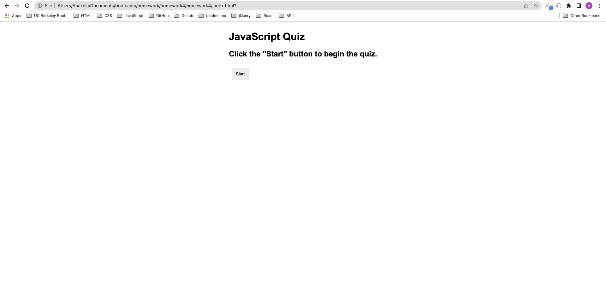
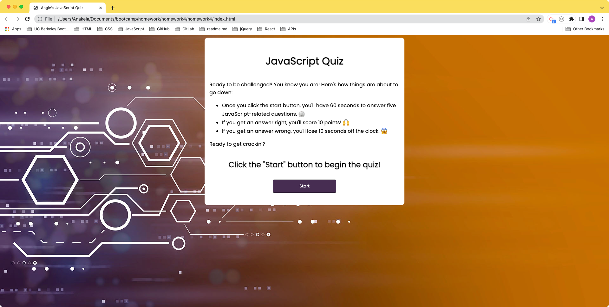

# Homework 4: Web APIs Challenge: Code Quiz

## Table of Contents

- [Overview](#overview)
  - [The Challenge](#the-challenge)
  - [User Story](#user-story)
  - [Acceptance Criteria](#acceptance-criteria)
  - [Screenshot](#screenshot)
  - [Links](#links)
- [My Process](#my-process)
  - [Built With](#built-with)
  - [What I Learned](#what-i-learned)
  - [Continued Development](#continued-development)
  - [Useful Resources](#useful-resources)
- [Author](#author)
- [Acknowledgments](#acknowledgments)

**Note: Delete this note and update the table of contents based on what sections you keep.**

## Overview

### The Challenge

> As you proceed in your journey to becoming a full-stack web developer, it’s likely that you’ll be asked to complete a coding assessment, perhaps as part of an interview process. A typical coding assessment is a combination of multiple-choice questions and interactive coding challenges.

> To help you become familiar with these tests and give you a chance to apply the skills from this module, this week’s Challenge invites you to build a timed coding quiz with multiple-choice questions. This app will run in the browser, and will feature dynamically updated HTML and CSS powered by JavaScript code that you write. It will have a clean, polished, and responsive user interface. This week’s coursework will teach you all the skills you need to succeed in this assignment.

**NOTE**
> Coding assessments are an important part of the interview process for developers. In fact, employers often use them to filter out job candidates with a cut-off score. To help you prepare, we’ve developed a set of technical interview questions that you can answer throughout the course. The difficulty level of these questions will increase as you become a more proficient developer. If you take advantage of these opportunities to practice, you should be well-prepared to shine during the technical interview process toward the end of this course!

### User Story

> AS A coding boot camp student
> I WANT to take a timed quiz on JavaScript fundamentals that stores high scores
> SO THAT I can gauge my progress compared to my peers

### Acceptance Criteria

> GIVEN I am taking a code quiz  
> WHEN I click the start button  
> THEN a timer starts and I am presented with a question  
> WHEN I answer a question  
> THEN I am presented with another question  
> WHEN I answer a question incorrectly  
> THEN time is subtracted from the clock  
> WHEN all questions are answered or the timer reaches 0  
> THEN the game is over  
> WHEN the game is over  
> THEN I can save my initials and score  

### Screenshot



### Links

- Solution URL: [https://github.com/anakela/code-quiz](https://github.com/anakela/code-quiz)
- Live Site URL: [https://anakela.github.io/code-quiz/](https://anakela.github.io/code-quiz/)

## My Process

### Built With

- Semantic HTML5 markup
- CSS
- JavaScript

### What I Learned

I learned a lot about JavaScript while creating this quiz, most especially how to call functions within other functions, adding event listeners and onclick functions to variables, and comparing objects and arrays with user input.

One of the parts of my code that I'm most especially proud of is my checkAnswers function.  I figured out how to compare users' button clicks with the correct answers in my array of objects.

```
function displayQuestions() {
    showQuestions.textContent = questionArray[questionIndex].Q;
    console.log(showAnswers);
    for (let i = 0; i < questionArray[questionIndex].A.length; i++) {
        let answerButton = document.createElement("button");
        answerButton.textContent = questionArray[questionIndex].A[i];

        // Define the function here to check the answers
        answerButton.onclick = function checkAnswers() {
            // If the submission is equal to Correct...
            if (answerButton.innerText === questionArray[questionIndex].Correct) {
                // ...show this confirmation message.
                results.textContent = "Right on, popcorn! That's correct.";
                // ...add 10 points to the score.
                currentPoints += 10;
                // ...display the total current points.
                pointsCounter.textContent = currentPoints;
                // ...if the questionIndex is less than the length of the questionArray...
                if (questionIndex < questionArray.length) {
                    // ...increment the questionIndex.
                    questionIndex++;
                    // ...clear the showAnswers section.
                    showAnswers.innerHTML = '';
                    // ...display the next question.
                    displayQuestions();
                    // If the questionIndex is not less than the length of the questionArray, end the game.
                } else {
                    // Show scoreboard
                    pointsCounter.textContent = currentPoints;
                }
                // If the submission is not equal to Correct...
            } else {
                // ...show this error message and...
                results.textContent = "Negative, Ghost Rider. That's incorrect.";
                // ...if the questionIndex is less than the length of the questionArray...
                if (questionIndex < questionArray.length) {
                    // ...increment the questionIndex.
                    questionIndex++;
                    // ...deduct 10 seconds from the clock.
                    secondsLeft -= 10;
                    // ...clear the showAnswers section.
                    showAnswers.innerHTML = '';
                    // ...display the next question.
                    displayQuestions();
                    // If the questionIndex is not less than the length of the questionArray, end the game.
                } else {
                    // Show scoreboard
                    pointsCounter.textContent = currentPoints;
                }
            }
        }
        showAnswers.appendChild(answerButton);

    }
    console.log(displayQuestions);
}
```

### Continued Development

This was one of the most difficult assignments we've had in bootcamp yet, but I feel like it included so much functionality that I can take into future projects.  For example, I used the following and more:
- For loops
- Onclick functions
- Event listeners
- Index incrementing
- Updating scores
- Creating a running clock
- Removing time from a clock for incorrect answers

### Useful Resources

- [W3Schools: onclick Event](https://www.w3schools.com/jsref/event_onclick.asp)+
- [W3Schools: Style display Property](https://www.w3schools.com/jsref/prop_style_display.asp)
- [W3Schools: HTML Forms](https://www.w3schools.com/html/html_forms.asp)
- [W3Schools:JavaScript For Loop](https://www.w3schools.com/js/js_loop_for.asp)
- [W3Schools: JavaScript Display Objects](https://www.w3schools.com/js/js_object_display.asp)
- [How to loop through an array of objects in JavaScript](https://attacomsian.com/blog/javascript-iterate-array-of-objects)
- [JSFiddle: Running Clock Demo](http://jsfiddle.net/alnitak/aBWce/)
- [Stack Overflow: How do I get my for loop to go through my array of objects?](https://stackoverflow.com/questions/72336180/how-do-i-get-my-for-loop-to-go-through-my-array-of-objects) - I asked this question, but it didn't provide too much useful feedback.
- [Stack Overflow: What does [object Object] mean? (JavaScript)](https://stackoverflow.com/questions/8892465/what-does-object-object-mean-javascript)
- [Stack Overflow: How to check the correct answer JavaScript (4 BUTTONS)](https://stackoverflow.com/questions/62594459/how-to-check-the-correct-answer-javascript-4-buttons)
- [how to add and subtract time from a timer with a button in javascript](https://stackoverflow.com/questions/63307047/how-to-add-and-subtract-time-from-a-timer-with-a-button-in-javascript)
- [Adding / subtracting time from a countdown in javascript](https://stackoverflow.com/questions/38669034/adding-subtracting-time-from-a-countdown-in-javascript)
- [Add Minutes or Seconds to the Javascript countdown timer?](https://stackoverflow.com/questions/18831523/add-minutes-or-seconds-to-the-javascript-countdown-timer)
- [Scheduling: setTimeout and setInterval](https://javascript.info/settimeout-setinterval)
- [MDN Web Docs: What is JavaScript?](https://developer.mozilla.org/en-US/docs/Learn/JavaScript/First_steps/What_is_JavaScript)
- [MDN Web Docs: JavaScript](https://developer.mozilla.org/en-US/docs/Web/JavaScript)
- [MDN Web Docs: clearInterval()](https://developer.mozilla.org/en-US/docs/Web/API/clearInterval)
- [MDN Web Docs: Loop and iteration](https://developer.mozilla.org/en-US/docs/Web/JavaScript/Guide/Loops_and_iteration)
- [MDN Web Docs: JavaScript data types and data structures](https://developer.mozilla.org/en-US/docs/Web/JavaScript/Data_structures)
- [MDN Web Docs: Document.createElement()](https://developer.mozilla.org/en-US/docs/Web/API/Document/createElement)
- [MDN Web Docs: Array](https://developer.mozilla.org/en-US/docs/Web/JavaScript/Reference/Global_Objects/Array)
- [MDN Web Docs: setInterval()](https://developer.mozilla.org/en-US/docs/Web/API/setInterval)
- [GlobalEventHandlers.onclick](https://developer.mozilla.org/en-US/docs/Web/API/GlobalEventHandlers/onclick)
- [Storing and retrieving JavaScript objects in localStorage](https://blog.logrocket.com/storing-retrieving-javascript-objects-localstorage/)
- [Flex Cheatsheet](https://yoksel.github.io/flex-cheatsheet/#section-declaring)
- [Top 100 JavaScript Interview Questions and Answers for 2022](https://www.guru99.com/javascript-interview-questions-answers.html)
- [Difference between textContent and innerHTML](https://www.geeksforgeeks.org/difference-between-textcontent-and-innerhtml/)
- [How to Make a Simple JavaScript Quiz](https://www.sitepoint.com/simple-javascript-quiz/)
- [JavaScript: Printing array elements](https://sebhastian.com/javascript-print-array/)
- [How to print object by id in an array of objects in JavaScript?](https://www.geeksforgeeks.org/how-to-print-object-by-id-in-an-array-of-objects-in-javascript/)
- [JavaScript Array of Objects Tutorial – How to Create, Update, and Loop Through Objects Using JS Array Methods](https://www.freecodecamp.org/news/javascript-array-of-objects-tutorial-how-to-create-update-and-loop-through-objects-using-js-array-methods/)
- [How to access JSON object in JavaScript](https://mkyong.com/javascript/how-to-access-json-object-in-javascript/)
- [Adobe Stock: Digital technology and science background.](https://stock.adobe.com/images/digital-technology-and-science-background/164562091?prev_url=detail)

## Author

- GitHub - [@anakela](https://github.com/anakela)
- LinkedIn - [@anakela](https://www.linkedin.com/in/anakela/)

## Acknowledgments

- Fellow Bootcampers:
  - Michael Harris
  - Asha Chakre
  - Robert M. Greene
  - Ivy Chang
  - Nolan Spence
  - James Montgomery
- Scott Nelson (TA)
- Bobbi Tarkany (Tutor)
